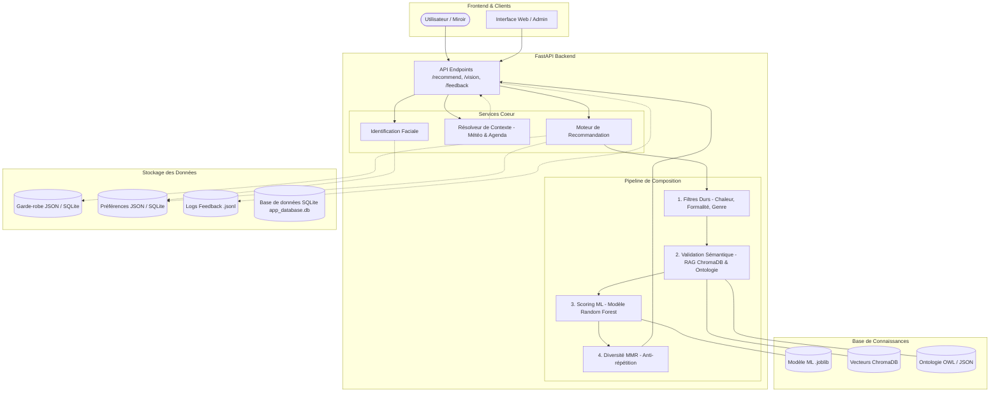

# ML Outfit Suggestion

> Base de projet ML pour proposer des tenues personnalisées pour [MagicMirror](https://github.com/josoavj/magicmirror) selon le profil utilisateur et le contexte du jour.

**Critères pris en compte :** sexe · âge · taille · planning du jour · préférences vestimentaires · morphologie · météo et lieu

---

## Table des matières

1. [Architecture](#architecture)
2. [Prérequis](#prérequis)
3. [Installation](#installation)
4. [Entraînement du modèle](#entraînement-du-modèle)
5. [Lancer l'API](#lancer-lapi)
6. [Interface Web de test](#interface-web-de-test)
7. [Liaison API avec l'application](#liaison-api-avec-lapplication-magicmirrorflutter)
8. [Contrat de réponse](#contrat-de-réponse-recommandation)
9. [Mode intégration automatique](#mode-intégration-automatique-direct-application)
10. [Mode fichier local](#si-tu-nas-pas-encore-dapi-magicmirror)
11. [Identification faciale](#identification-faciale-caméra-pour-miroir-intelligent)
12. [Recommandation depuis contexte réel](#recommandation-depuis-contexte-réel-agenda--météo)
13. [Exemple d'appel manuel](#exemple-dappel-manuel)
14. [Collecte feedback](#collecte-feedback-données-réelles)
15. [Entraînement avec données réelles](#entraînement-avec-données-réelles)
16. [Limites et suite](#limites-et-suite)
17. [À propos](#à-propos)

---

## Architecture

Le système repose sur un moteur de recommandation hybride alliant logique formelle, recherche vectorielle et apprentissage automatique.



Le système est composé de 3 piliers principaux :

### 1. Analyse du Contexte et Identification
Identification faciale via caméra pour charger le profil utilisateur, couplée à une récupération en temps réel de la météo (OpenWeather) et de l'agenda pour définir les contraintes du jour.

### 2. Moteur de Composition Dynamique
Un pipeline en 4 étapes qui transforme le dressing brut en tenues cohérentes :
- **Logique Formelle** : Utilisation de l'ontologie OWL pour l'harmonie des couleurs et la formalité.
- **RAG ChromaDB** : Validation sémantique avancée basée sur des règles de style textuelles.
- **Scoring ML** : Classement des meilleures combinaisons via un modèle Random Forest réentraîné.
- **Diversité MMR** : Algorithme de rotation pour éviter de suggérer toujours les mêmes vêtements.

### 3. API, Sécurité et Observabilité
Interface FastAPI sécurisée avec console interactive, questionnaires d'onboarding, gestion de garde-robe et dashboard technique complet pour le suivi des métriques et du feedback.
- **Sécurité :** Authentification `X-API-Key` en temps constant (`secrets.compare_digest`), sanitisation des identifiants contre les attaques Path Traversal, et limite de 5 Mo sur l'upload d'images Base64.
- **Stockage unifié :** Support transparent des fichiers JSON et de la base relationnelle SQLite (`STORAGE_BACKEND=sqlite`) en mode WAL haute concurrence.
- **CI/CD :** Pipeline GitHub Actions automatisé (`.github/workflows/ci.yml`) pour la validation du dataset et l'exécution des tests unitaires Pytest.

---

## Prérequis

- Python 3.11+

---

## Installation

```bash
python -m venv .venv
source .venv/bin/activate
pip install -r requirements.txt
# ChromaDB initialisera son index au premier démarrage
```

---

## Configuration & Base de données

Configurez le comportement du stockage et de la sécurité via le fichier `.env` :

```env
# Moteur de stockage (file = fichiers JSON locaux, sqlite = base SQLite app_database.db)
STORAGE_BACKEND=sqlite

# Clé API et sécurité
API_AUTH_ENABLED=true
API_AUTH_KEY=votre_cle_secrete_api
ALLOWED_ORIGINS=https://votre-app.example.com

# Clé météo OpenWeather
OPENWEATHER_API_KEY=votre_cle_openweather
```

---

## Tests et Intégration Continue (CI)

Lancer la suite de tests complète (11 tests unitaires et de sécurité) :

```bash
PYTHONPATH=src python -m pytest src/outfit_ml/tests/ -v
```

Le projet intègre un workflow **GitHub Actions** (`.github/workflows/ci.yml`) qui exécute automatiquement cette commande et valide le contrat de données sur Python 3.11 et 3.12 à chaque commit.

---

## Entraînement du modèle

```bash
python -m src.outfit_ml.train --samples 4000
```

**Fichiers produits :**

```
models/
├── outfit_ranker.joblib
└── outfit_ranker_metrics.json
```

**Validation du dataset avant entraînement** (recommandé) :

```bash
python -m src.outfit_ml.dataset.validate_dataset --dataset-root data/dataset
```

**Conversion CSV → Parquet partitionné par date :**

```bash
python -m src.outfit_ml.dataset.export_parquet \
  --dataset-root data/dataset \
  --output-root data/parquet
```

---

## Lancer l'API

**Option recommandée avec `.env` :**

```bash
cp .env.example .env
# Édite .env et renseigne tes vraies valeurs
uvicorn src.outfit_ml.api:app --reload
```

L'API charge automatiquement les variables depuis `.env`.

**Option via export shell :**

```bash
export OPENWEATHER_API_KEY="ta_cle_openweather"
uvicorn src.outfit_ml.api:app --reload
```

---

## Interface Web de test

URL : `http://127.0.0.1:8000/ui`

L'interface se décompose en plusieurs modules :
- **Présentation** : Vue d'ensemble du système.
- **Onboarding** : Questionnaire de définition du profil de style utilisateur.
- **Garde-robe** : Gestion du dressing digital (ajout et suppression d'items).
- **Test** : Simulateur de recommandation avec résolution météo automatique.
- **Métriques** : Dashboard technique (fraîcheur du modèle et feedback).
- **API Console** : Console interactive pour tester tous les endpoints.

> En mode manuel dans l'onglet Test, la météo est résolue par la ville via OpenWeather. Il est possible de forcer des valeurs spécifiques pour simuler des cas extrêmes.

---

## Liaison API avec l'application (MagicMirror/Flutter)

Le service expose une API FastAPI consommée directement par l'application.

**Configuration minimale recommandée dans `.env` :**

```env
API_AUTH_ENABLED=true
API_AUTH_KEY=replace_with_strong_shared_secret
ALLOWED_ORIGINS=https://your-magicmirror-app.example.com
```

L'application doit envoyer l'en-tête HTTP suivant :

```
X-API-Key: replace_with_strong_shared_secret
```

**Endpoint principal recommandé côté application :**

```
POST /mirror/recommend-from-camera
```

Ce endpoint couvre le flux complet : identification + contexte + recommandations.

---

## Contrat de réponse (recommandation)

Les réponses de recommandation incluent :

| Champ | Description |
|---|---|
| `suggestions` | Top-k tenues avec score et raisons |
| `inferred_body_shape` | Morphologie déduite |
| `dominant_occasion` | Occasion principale détectée |
| `weather_bucket` | Bucket météo utilisé |
| `resolved_context.source` | `manual` · `context` · `auto` |
| `resolved_context.location` | Lieu effectif |
| `resolved_context.weather` | Température + condition utilisées |
| `resolved_context.agenda_labels` | Labels agenda interprétés |
| `resolved_context.openweather` | Ville, pays, ressenti, humidité, vent *(flux `context` et `auto`)* |

**Exemple minimal de `resolved_context` :**

```json
{
  "source": "auto",
  "location": "Lyon",
  "weather": {
    "temperature_c": 18.3,
    "condition": "clear"
  },
  "agenda_labels": ["work", "meeting"],
  "openweather": {
    "city": "Lyon",
    "country": "FR",
    "temperature_c": 18.3,
    "feels_like_c": 17.8,
    "humidity_percent": 52,
    "condition": "Clear",
    "description": "clear sky",
    "wind_speed_m_s": 2.7
  }
}
```

---

## Mode intégration automatique (direct application)

Configure les variables de ton API backend :

```env
MAGICMIRROR_API_BASE_URL=https://ton-app.example.com
MAGICMIRROR_API_TOKEN=token_optionnel
MAGICMIRROR_PROFILE_PATH_TEMPLATE=/api/users/{user_id}/profile
MAGICMIRROR_AGENDA_PATH_TEMPLATE=/api/users/{user_id}/agenda/today
```

**Appel minimal :**

```bash
curl -X POST "http://127.0.0.1:8000/recommend/auto" \
  -H "Content-Type: application/json" \
  -d '{
    "user_id": "u-001",
    "location": "Lyon",
    "top_k": 3
  }'
```

**Avec overrides** *(prioritaires sur le profil récupéré)* :

```bash
curl -X POST "http://127.0.0.1:8000/recommend/auto" \
  -H "Content-Type: application/json" \
  -d '{
    "user_id": "u-001",
    "location": "Lyon",
    "gender": "female",
    "age": 29,
    "top_size": "m",
    "bottom_size": "m",
    "shoe_size": "40",
    "style_preferences": ["minimalist", "elegant"],
    "agenda": ["work", "meeting"],
    "top_k": 3
  }'
```

Dans ce mode, le service effectue automatiquement :

1. Lecture du profil utilisateur (sexe, âge, taille, préférences, morphologie)
2. Lecture de l'agenda du jour depuis l'application
3. Récupération de la météo via OpenWeather
4. Recommandation top-k sans payload manuel complexe

---

## Si tu n'as pas encore d'API MagicMirror

Tu peux fonctionner en **mode fichier local** immédiatement.

**1. Utiliser les fichiers JSON locaux :**

```
data/users/u-001/
├── profile.json
└── agenda_today.json
```

**2. Configurer `.env` :**

```env
MAGICMIRROR_DATA_SOURCE=file
OPENWEATHER_API_KEY=ta_cle_openweather
MAGICMIRROR_PROFILE_FILE_TEMPLATE=data/users/{user_id}/profile.json
MAGICMIRROR_AGENDA_FILE_TEMPLATE=data/users/{user_id}/agenda_today.json
```

**3. Appeler le endpoint auto :**

```bash
curl -X POST "http://127.0.0.1:8000/recommend/auto" \
  -H "Content-Type: application/json" \
  -d '{"user_id": "u-001", "top_k": 3}'
```

> Quand ton API backend sera disponible, il suffira de passer `MAGICMIRROR_DATA_SOURCE=api`.

---

## Identification faciale (caméra pour miroir intelligent)

Le projet inclut un module local d'identification faciale : enrôlement d'un visage et identification depuis une image caméra.

**Configuration :**

```bash
pip install face-recognition
export FACE_REGISTRY_PATH=data/vision/face_registry.json
```

> ⚠️ **Recommandations production :** utiliser uniquement sur consentement explicite, conserver les données en local (pas d'envoi cloud), ajouter un anti-spoofing (liveness) avant de valider l'identité.

### Endpoints vision

**`POST /vision/enroll`** — Enrôler un utilisateur :

```json
{
  "user_id": "u-001",
  "image_base64": "data:image/jpeg;base64,..."
}
```

**`POST /vision/identify`** — Identifier un visage :

```json
{
  "image_base64": "data:image/jpeg;base64,...",
  "threshold": 0.45,
  "max_results": 1
}
```

### Endpoint unique Android / Web / Webcam

**`POST /mirror/recommend-from-camera`** — Flux complet en une seule requête après capture caméra :

```json
{
  "image_base64": "data:image/jpeg;base64,...",
  "location": "Lyon",
  "threshold": 0.45,
  "top_k": 3
}
```

Ce endpoint enchaîne automatiquement :

1. Identification faciale
2. Récupération du profil + agenda du jour
3. Récupération météo OpenWeather
4. Retour des suggestions de tenue

---

## Recommandation depuis contexte réel (agenda + météo)

Utilise cet endpoint quand l'application dispose déjà des données agenda. La météo est récupérée automatiquement via OpenWeather à partir de `location`.

```bash
curl -X POST "http://127.0.0.1:8000/recommend/context" \
  -H "Content-Type: application/json" \
  -d '{
    "user_id": "u-001",
    "gender": "female",
    "age": 29,
    "height_cm": 168,
    "clothing_size": "m",
    "top_size": "m",
    "bottom_size": "m",
    "shoe_size": "40",
    "style_preferences": ["minimalist", "elegant"],
    "body_measurements": {
      "shoulders_cm": 95,
      "waist_cm": 70,
      "hips_cm": 98
    },
    "agenda_entries": [
      {"title": "Daily Work Meeting", "category": "work", "tags": ["office"]},
      {"title": "Client presentation", "category": "meeting", "tags": ["formal"]}
    ],
    "location": "Lyon",
    "top_k": 3
  }'
```

---

## Exemple d'appel manuel

**`POST /recommend`** — avec profil et contexte complets :

```bash
curl -X POST "http://127.0.0.1:8000/recommend" \
  -H "Content-Type: application/json" \
  -d '{
    "user_id": "u-001",
    "gender": "female",
    "age": 29,
    "height_cm": 168,
    "clothing_size": "m",
    "top_size": "m",
    "bottom_size": "m",
    "shoe_size": "40",
    "style_preferences": ["minimalist", "elegant"],
    "body_measurements": {
      "shoulders_cm": 95,
      "waist_cm": 70,
      "hips_cm": 98
    },
    "agenda": ["work", "meeting"],
    "location": "Lyon",
    "weather": {
      "temperature_c": 14,
      "condition": "rain"
    },
    "top_k": 3
  }'
```

---

## Collecte feedback (données réelles)

**Endpoints disponibles :**

| Endpoint | Description |
|---|---|
| `POST /feedback/event` | Loguer un événement unique |
| `POST /feedback/batch` | Loguer une session complète |
| `POST /feedback/events` | Variante batch |
| `GET /feedback/stats` | Consulter le volume et la répartition |

**Types d'événements :** `impression` · `click` · `selected` · `dismissed`

**Exemple d'événement unitaire :**

```json
{
  "session_id": "s-001",
  "user_id": "u-001",
  "outfit_id": "smart_casual",
  "event_type": "impression",
  "score": 0.8732,
  "metadata": {
    "rank_position": 0,
    "source": "ui"
  }
}
```

**Exemple batch (session complète en un appel) :**

```json
{
  "events": [
    {
      "session_id": "s-001",
      "user_id": "u-001",
      "outfit_id": "smart_casual",
      "event_type": "impression",
      "score": 0.8732,
      "metadata": {
        "rank_position": 0,
        "source": "ui"
      }
    },
    {
      "session_id": "s-001",
      "user_id": "u-001",
      "outfit_id": "smart_casual",
      "event_type": "selected",
      "score": 0.9921,
      "metadata": {
        "rank_position": 0,
        "source": "ui"
      }
    }
  ]
}
```

---

## Entraînement avec données réelles

Le trainer utilise un log enrichi d'interactions et bascule automatiquement sur le synthétique si le volume est insuffisant.
Les endpoints `/feedback/*` produisent un format minimal (utile pour analytics), mais pas assez riche pour l'entraînement réel.
Pour l'entraînement, il faut un `events.jsonl` qui contient aussi `gender`, `age`, `height_cm`, `body_shape`,
`style_preferences`, `dominant_occasion`, `weather_bucket` et `session_id` par impression.

```bash
python -m src.outfit_ml.train \
  --prefer-real-data \
  --real-feedback-log data/feedback/events.jsonl \
  --min-real-samples 200 \
  --split-mode time
```

**Métriques supplémentaires** si `session_id` est présent :

`precision_at_3` · `recall_at_3` · `ndcg_at_3`

---

## Limites et suite

| Limite | Action recommandée |
|---|---|
| Dataset d'entraînement synthétique | Remplacer par de vraies interactions utilisateurs (feedback implicite/explicite) |
| Météo et agenda simulés | Intégrer une source météo réelle et l'agenda MagicMirror |

---

## À propos

Développeur : [josoavj](https://github.com/josoavj)