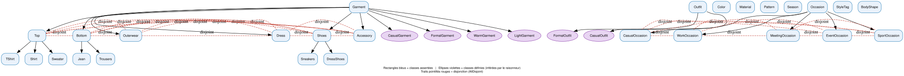
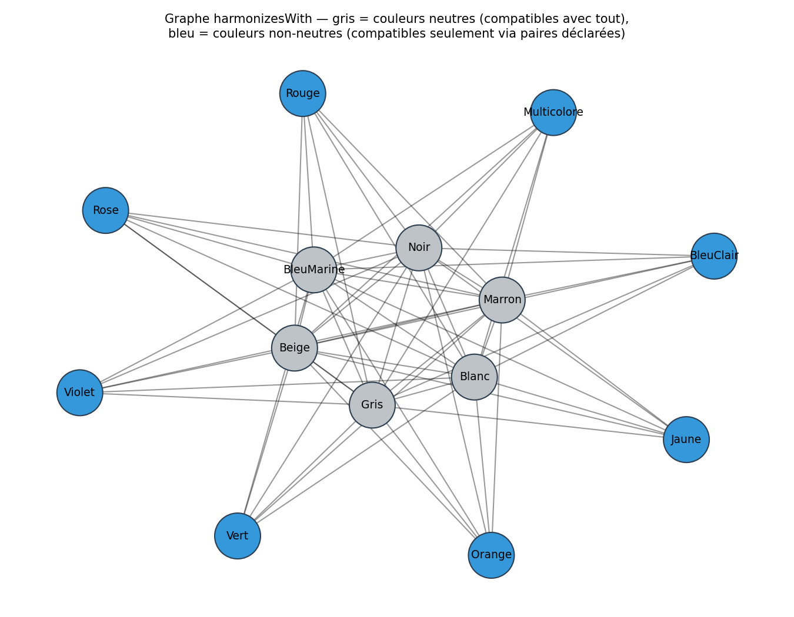

# Intégration de l'Ontologie OWL

L'application utilise une ontologie formelle (Web Ontology Language - OWL) pour centraliser et unifier la connaissance du domaine vestimentaire. Cette ontologie sert de source de vérité unique pour les règles métier, remplaçant les configurations dispersées et dupliquées dans le code.

## Architecture

L'intégration est divisée en deux phases pour garantir des performances optimales en production tout en conservant la puissance du raisonnement logique :

1.  **Phase Offline (Raisonnement)** : L'ontologie est construite et interrogée par un raisonneur logique (HermiT). Les résultats (inférences) sont exportés dans des fichiers JSON légers.
2.  **Phase Runtime (Production)** : L'API consulte uniquement les fichiers JSON pré-calculés, évitant ainsi toute dépendance lourde à Java ou au moteur de raisonnement pendant les recommandations.

## Visualisation du Modèle

Voici la structure logique générée à partir de l'ontologie réelle du projet :

### Hiérarchie des Classes
La hiérarchie définit les catégories de vêtements (Haut, Bas, Chaussures) et leurs relations de disjonction (un vêtement ne peut pas appartenir à deux catégories racines simultanément). Les ellipses violettes représentent les classes **inférées dynamiquement** (ex: vêtement formel vs décontracté).



### Réseau d'Harmonie des Couleurs
Ce graphe montre comment les couleurs neutres (en gris) servent de connecteurs universels, tandis que les couleurs vives (en bleu) ne s'harmonisent qu'entre elles via des paires complémentaires spécifiques définies dans l'ontologie.



## Structure des fichiers

-   **`src/outfit_ml/ontology/outfit_ontology.py`** : Définition de l'ontologie (classes, propriétés, individus et règles SWRL).
-   **`src/outfit_ml/ontology/export_rules.py`** : Script pour exécuter le raisonneur et générer les données dérivées.
-   **`data/ontology_derived/`** : Fichiers JSON contenant les règles de compatibilité et de formalité inférées.
-   **`src/outfit_ml/composition/ontology_rules.py`** : Interface de production pour interroger les règles exportées.

## Règles modélisées

Actuellement, l'ontologie gère :
-   **Harmonie des couleurs** : Un graphe complet incluant les couleurs neutres et les paires complémentaires.
-   **Formalité par occasion** : Niveaux de formalité minimale requis pour chaque type d'agenda (Travail, Réunion, Sport, etc.).
-   **Classification automatique** : Les vêtements sont classés dynamiquement (ex: `FormalGarment`) selon leurs attributs.

## Maintenance et Évolution

Chaque fois que vous modifiez les règles dans `outfit_ontology.py`, vous devez régénérer les fichiers de production :

```bash
export PYTHONPATH=$PYTHONPATH:.
python -m src.outfit_ml.ontology.export_rules
```

Cette étape est automatisable en intégration continue (CI).

## Futures extensions

L'ontologie a été conçue pour être étendue à :
-   La compatibilité des matières (ex: Lin + Laine).
-   L'adéquation morphologique (BodyShape).
-   Les contraintes de saisonnalité avancées.
